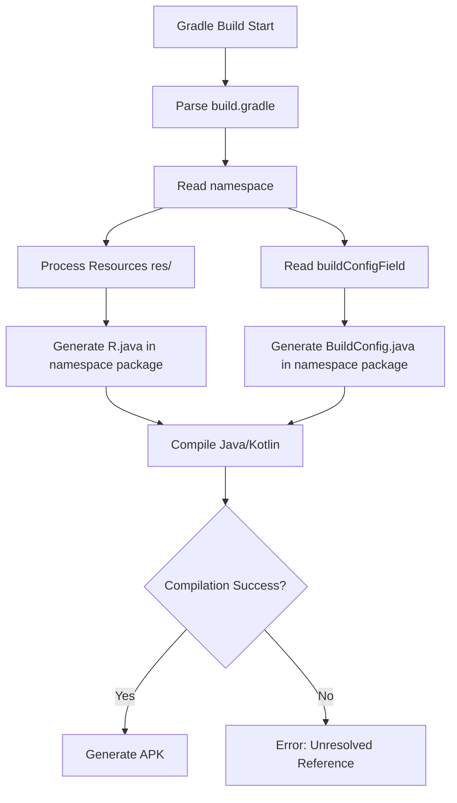

# Phân Tích và Giải Quyết Lỗi Android Build: Unresolved Reference R và BuildConfig

## Mục Lục

1. [Tổng Quan Vấn Đề](#1-tổng-quan-vấn-đề)
2. [Nguyên Nhân Gốc Rễ](#2-nguyên-nhân-gốc-rễ)
3. [Cơ Chế Generate R và BuildConfig](#3-cơ-chế-generate-r-và-buildconfig)
4. [5 Nguyên Nhân Phổ Biến Nhất](#4-5-nguyên-nhân-phổ-biến-nhất)
5. [Các Bước Fix Chi Tiết](#5-các-bước-fix-chi-tiết)
6. [Checklist Debug](#6-checklist-debug)
7. [Kiểm Tra Namespace và Package Structure](#7-kiểm-tra-namespace-và-package-structure)
8. [Kết Luận](#8-kết-luận)

---

## 1. Tổng Quan Vấn Đề

### Thông Tin Lỗi

```
Task :app:compileDebugKotlin FAILED
Unresolved reference 'R'
Unresolved reference 'BuildConfig'
```

### File Bị Lỗi

- `MainActivity.kt` (line 18): `setTheme(R.style.AppTheme)`
- `MainApplication.kt` (line 31, 33, 36): `BuildConfig.DEBUG`, `BuildConfig.IS_NEW_ARCHITECTURE_ENABLED`, `BuildConfig.REACT_NATIVE_RELEASE_LEVEL`

### Môi Trường

- React Native: 0.81.5
- Expo SDK: ~54.0.31
- Kotlin: 2.1.20
- compileSdk: 36
- targetSdk: 36
- New Architecture: Enabled

---

## 2. Nguyên Nhân Gốc Rễ

### Vấn Đề Chính: Package Mismatch

Sau khi phân tích cấu trúc project, phát hiện **sự không khớp nghiêm trọng** giữa:


| Vị Trí | Package/Namespace | Trạng Thái |
|--------|-------------------|------------|
| **MainActivity.kt** | `package com.eztro.eztroalpha` | ✅ Đúng |
| **MainApplication.kt** | `package com.eztro.eztroalpha` | ✅ Đúng |
| **build.gradle (namespace)** | `namespace "com.eztroalpha"` | ❌ SAI |
| **build.gradle (applicationId)** | `applicationId "com.eztroalpha"` | ❌ SAI |
| **app.json (android.package)** | `"package": "com.eztro.eztroalpha"` | ✅ Đúng |

### Tại Sao Lỗi Xảy Ra?

Android Gradle Plugin (AGP) 7.0+ sử dụng `namespace` để xác định package nơi generate các class:
- `R.java` (resource references)
- `BuildConfig.java` (build configuration)

**Khi namespace = `com.eztroalpha`:**
- AGP generate: `com.eztroalpha.R` và `com.eztroalpha.BuildConfig`

**Nhưng Kotlin files khai báo:**
- `package com.eztro.eztroalpha`
- Import tìm kiếm: `com.eztro.eztroalpha.R` và `com.eztro.eztroalpha.BuildConfig`

**Kết quả:** Kotlin compiler không tìm thấy → `Unresolved reference`

---

## 3. Cơ Chế Generate R và BuildConfig

### 3.1. Quy Trình Build Android




### 3.2. R.java Generation

**R.java** là file auto-generated chứa ID constants cho tất cả resources:

```java
// Generated at: build/generated/source/r/debug/com/eztroalpha/R.java
package com.eztroalpha; // ← Dựa vào namespace trong build.gradle

public final class R {
    public static final class style {
        public static final int AppTheme = 0x7f0b0001;
    }
    public static final class drawable {
        public static final int icon = 0x7f020001;
    }
    // ... more resources
}
```

**Điều kiện để generate thành công:**
1. `namespace` được khai báo trong `build.gradle`
2. Resources tồn tại trong `res/` folder
3. Không có lỗi XML trong resource files
4. AAPT2 (Android Asset Packaging Tool) hoạt động bình thường

### 3.3. BuildConfig.java Generation

**BuildConfig.java** chứa build-time constants:

```java
// Generated at: build/generated/source/buildConfig/debug/com/eztroalpha/BuildConfig.java
package com.eztroalpha; // ← Dựa vào namespace trong build.gradle

public final class BuildConfig {
    public static final boolean DEBUG = true;
    public static final String APPLICATION_ID = "com.eztroalpha";
    public static final String BUILD_TYPE = "debug";
    public static final int VERSION_CODE = 1;
    public static final String VERSION_NAME = "1.0";
    
    // Custom fields from buildConfigField
    public static final boolean IS_NEW_ARCHITECTURE_ENABLED = true;
    public static final String REACT_NATIVE_RELEASE_LEVEL = "stable";
}
```

**Điều kiện để generate thành công:**
1. `namespace` được khai báo
2. `buildConfigField` syntax đúng (nếu có custom fields)
3. Build variant được chọn (debug/release)


### 3.4. Namespace vs ApplicationId

| Thuộc Tính | Mục Đích | Ảnh Hưởng |
|------------|----------|-----------|
| **namespace** | Package cho generated code (R, BuildConfig) | Compile-time: Kotlin/Java imports |
| **applicationId** | Unique identifier trên Play Store | Runtime: App installation, updates |

**Quan trọng:** Hai giá trị này CÓ THỂ khác nhau, nhưng phải nhất quán với package declaration trong Kotlin/Java files.

---

## 4. 5 Nguyên Nhân Phổ Biến Nhất

### 4.1. Package Mismatch (Nguyên nhân của bạn) ⭐

**Mô tả:** `namespace` trong `build.gradle` khác với `package` trong Kotlin files.

**Dấu hiệu:**
- Lỗi compile: `Unresolved reference 'R'` và `Unresolved reference 'BuildConfig'`
- Build thành công trước đây, sau khi refactor package bị lỗi

**Fix:**
```gradle
// build.gradle (app level)
android {
    namespace "com.eztro.eztroalpha" // ← Phải khớp với package trong .kt files
    defaultConfig {
        applicationId "com.eztro.eztroalpha" // ← Nên giống namespace (best practice)
    }
}
```

### 4.2. Resource Errors

**Mô tả:** Lỗi XML trong resource files ngăn R.java được generate.

**Dấu hiệu:**
- Lỗi AAPT2: `error: resource ... not found`
- Missing `@string/app_name`, `@style/AppTheme`, etc.

**Fix:**
- Kiểm tra `res/values/strings.xml`, `res/values/styles.xml`
- Đảm bảo tất cả resources được reference đều tồn tại


### 4.3. Gradle Sync Issues

**Mô tả:** Gradle cache bị corrupt hoặc dependencies không được resolve.

**Dấu hiệu:**
- Build fails ngay cả khi code đúng
- IDE không nhận diện R và BuildConfig (red underline)
- Lỗi: `Could not resolve all files for configuration`

**Fix:**
```bash
cd EzTro_Alpha/android
./gradlew clean
./gradlew --stop
rm -rf .gradle build app/build
./gradlew assembleDebug
```

### 4.4. Kotlin Version Incompatibility

**Mô tả:** Kotlin 2.1.20 có thể có issues với React Native 0.81.5 (older version).

**Dấu hiệu:**
- Lỗi: `Compilation error. See log for more details`
- Kotlin compiler crashes hoặc hangs

**Fix:**
```gradle
// android/build.gradle
buildscript {
    ext.kotlinVersion = '1.9.22' // ← Downgrade to stable version
    dependencies {
        classpath("org.jetbrains.kotlin:kotlin-gradle-plugin:$kotlinVersion")
    }
}
```

### 4.5. Missing BuildConfig Generation

**Mô tả:** AGP 8.0+ disable BuildConfig generation by default.

**Dấu hiệu:**
- Chỉ lỗi `BuildConfig`, không lỗi `R`
- Lỗi: `Unresolved reference: BuildConfig`

**Fix:**
```gradle
// build.gradle (app level)
android {
    buildFeatures {
        buildConfig = true // ← Enable BuildConfig generation
    }
}
```

---

## 5. Các Bước Fix Chi Tiết

### Bước 1: Fix Namespace Mismatch (CRITICAL)

**File:** `EzTro_Alpha/android/app/build.gradle`


**Thay đổi:**

```gradle
android {
    // ... other config
    
    // ❌ BEFORE (SAI)
    namespace "com.eztroalpha"
    
    // ✅ AFTER (ĐÚNG)
    namespace "com.eztro.eztroalpha"
    
    defaultConfig {
        // ❌ BEFORE (SAI)
        applicationId "com.eztroalpha"
        
        // ✅ AFTER (ĐÚNG)
        applicationId "com.eztro.eztroalpha"
        
        // ... other config
    }
}
```

### Bước 2: Enable BuildConfig Generation (Preventive)

**File:** `EzTro_Alpha/android/app/build.gradle`

**Thêm vào block `android {}`:**

```gradle
android {
    // ... existing config
    
        buildFeatures {
            buildConfig = true  // Ensure BuildConfig is generated
        }
    
    // ... rest of config
}
```

### Bước 3: Clean Build

**Chạy commands sau:**

```bash
# Navigate to android folder
cd EzTro_Alpha/android

# Clean all build artifacts
./gradlew clean

# Stop Gradle daemon
 
# Remove cache directories (Windows PowerShell)
Remove-Item -Recurse -Force .gradle, build, app/build

# Rebuild
./gradlew assembleDebug
```


### Bước 4: Verify Generated Files

**Sau khi build thành công, kiểm tra:**

```bash
# Check R.java location
ls app/build/generated/source/r/debug/com/eztro/eztroalpha/R.java

# Check BuildConfig.java location
ls app/build/generated/source/buildConfig/debug/com/eztro/eztroalpha/BuildConfig.java
```

**Expected output:**
```
✅ app/build/generated/source/r/debug/com/eztro/eztroalpha/R.java
✅ app/build/generated/source/buildConfig/debug/com/eztro/eztroalpha/BuildConfig.java
```

### Bước 5: Verify AndroidManifest.xml

**File:** `EzTro_Alpha/android/app/src/main/AndroidManifest.xml`

**Kiểm tra package reference:**

```xml
<manifest xmlns:android="http://schemas.android.com/apk/res/android">
    <!-- ✅ Relative class names work with any namespace -->
    <application android:name=".MainApplication" ...>
        <activity android:name=".MainActivity" ...>
            <!-- ... -->
        </activity>
    </application>
</manifest>
```

**Lưu ý:** Sử dụng relative names (`.MainActivity`) thay vì fully qualified names để tránh hardcode package.

### Bước 6: Rebuild from Expo

**Sau khi fix Gradle:**

```bash
# Navigate back to project root
cd ..

# Clear Expo cache
npx expo start --clear

# Rebuild Android
npx expo run:android
```

---

## 6. Checklist Debug

### Pre-Build Checklist

- [ ] **Namespace khớp với package trong Kotlin files**
  ```
  build.gradle: namespace "com.eztro.eztroalpha"
  MainActivity.kt: package com.eztro.eztroalpha
  MainApplication.kt: package com.eztro.eztroalpha
  ```


- [ ] **ApplicationId khớp với app.json**
  ```
  build.gradle: applicationId "com.eztro.eztroalpha"
  app.json: "package": "com.eztro.eztroalpha"
  ```

- [ ] **BuildConfig generation enabled**
  ```gradle
  android {
      buildFeatures {
          buildConfig = true
      }
  }
  ```

- [ ] **Resources tồn tại**
  - [ ] `res/values/strings.xml` có `app_name`
  - [ ] `res/values/styles.xml` có `AppTheme`
  - [ ] Không có lỗi XML trong resource files

- [ ] **Gradle version compatibility**
  - [ ] AGP version: 8.x (check `android/build.gradle`)
  - [ ] Gradle version: 8.x (check `android/gradle/wrapper/gradle-wrapper.properties`)
  - [ ] Kotlin version: 1.9.x (recommended for RN 0.81.5)

### Build-Time Checklist

- [ ] **Clean build thành công**
  ```bash
  ./gradlew clean
  ./gradlew assembleDebug
  ```

- [ ] **No AAPT2 errors**
  - Check build output for `AAPT2 error`
  - Check for missing resource references

- [ ] **Generated files exist**
  - [ ] `app/build/generated/source/r/debug/com/eztro/eztroalpha/R.java`
  - [ ] `app/build/generated/source/buildConfig/debug/com/eztro/eztroalpha/BuildConfig.java`

### Post-Build Checklist

- [ ] **Kotlin compilation success**
  ```
  Task :app:compileDebugKotlin SUCCESS
  ```

- [ ] **APK generated**
  ```
  app/build/outputs/apk/debug/app-debug.apk
  ```

- [ ] **App installs and runs**
  ```bash
  adb install app/build/outputs/apk/debug/app-debug.apk
  ```


---

## 7. Kiểm Tra Namespace và Package Structure

### 7.1. Verify Current Configuration

**Command để kiểm tra nhanh:**

```bash
# Check namespace in build.gradle
grep -n "namespace" EzTro_Alpha/android/app/build.gradle

# Check applicationId in build.gradle
grep -n "applicationId" EzTro_Alpha/android/app/build.gradle

# Check package in Kotlin files
grep -n "^package" EzTro_Alpha/android/app/src/main/java/com/eztro/eztroalpha/*.kt

# Check package in app.json
grep -n "\"package\"" EzTro_Alpha/app.json
```

**Expected output:**

```
build.gradle:    namespace "com.eztro.eztroalpha"
build.gradle:    applicationId "com.eztro.eztroalpha"
MainActivity.kt:package com.eztro.eztroalpha
MainApplication.kt:package com.eztro.eztroalpha
app.json:    "package": "com.eztro.eztroalpha"
```

### 7.2. Package Structure Validation

**Correct structure:**

```
android/app/src/main/java/
└── com/
    └── eztro/
        └── eztroalpha/
            ├── MainActivity.kt (package com.eztro.eztroalpha)
            └── MainApplication.kt (package com.eztro.eztroalpha)
```

**Validation command:**

```bash
# List directory structure
tree EzTro_Alpha/android/app/src/main/java/com/

# Or on Windows PowerShell
Get-ChildItem -Recurse EzTro_Alpha/android/app/src/main/java/com/
```


### 7.3. Debug Generated Files Location

**Script để tìm R.java và BuildConfig.java:**

```bash
# Find R.java
find EzTro_Alpha/android/app/build -name "R.java" -type f

# Find BuildConfig.java
find EzTro_Alpha/android/app/build -name "BuildConfig.java" -type f
```

**Nếu files không tồn tại:**
1. Build chưa chạy hoặc failed
2. Namespace configuration sai
3. BuildConfig generation bị disable

**Nếu files tồn tại nhưng ở wrong package:**
- Check namespace trong `build.gradle`
- Rebuild sau khi fix

### 7.4. Inspect Generated Files Content

**Check R.java package:**

```bash
# View first 10 lines of R.java
head -n 10 EzTro_Alpha/android/app/build/generated/source/r/debug/com/eztro/eztroalpha/R.java
```

**Expected:**

```java
package com.eztro.eztroalpha; // ← Must match namespace

public final class R {
    // ...
}
```

**Check BuildConfig.java package:**

```bash
# View first 15 lines of BuildConfig.java
head -n 15 EzTro_Alpha/android/app/build/generated/source/buildConfig/debug/com/eztro/eztroalpha/BuildConfig.java
```

**Expected:**

```java
package com.eztro.eztroalpha; // ← Must match namespace

public final class BuildConfig {
    public static final boolean DEBUG = true;
    public static final boolean IS_NEW_ARCHITECTURE_ENABLED = true;
    // ...
}
```


---

## 8. Kết Luận

### Tóm Tắt Vấn Đề

Lỗi `Unresolved reference 'R'` và `Unresolved reference 'BuildConfig'` trong project của bạn xảy ra do **package mismatch** giữa:

- **Kotlin files:** `package com.eztro.eztroalpha` ✅
- **build.gradle namespace:** `namespace "com.eztroalpha"` ❌

Android Gradle Plugin generate `R.java` và `BuildConfig.java` trong package được định nghĩa bởi `namespace`, dẫn đến Kotlin compiler không tìm thấy các class này.

### Giải Pháp Chính

**Fix ngay lập tức:**

```gradle
// File: EzTro_Alpha/android/app/build.gradle

android {
    namespace "com.eztro.eztroalpha"  // ← Change from "com.eztroalpha"
    
    defaultConfig {
        applicationId "com.eztro.eztroalpha"  // ← Change from "com.eztroalpha"
        // ... rest of config
    }
    
    buildFeatures {
        buildConfig = true  // ← Add this to ensure BuildConfig generation
    }
}
```

**Sau đó clean build:**

```bash
cd EzTro_Alpha/android
./gradlew clean
./gradlew --stop
Remove-Item -Recurse -Force .gradle, build, app/build
./gradlew assembleDebug
```

### Best Practices

1. **Consistency is key:** Luôn giữ `namespace`, `applicationId`, và `package` declaration nhất quán
2. **Use relative names:** Trong AndroidManifest.xml, dùng `.MainActivity` thay vì fully qualified names
3. **Enable BuildConfig explicitly:** Với AGP 8.0+, luôn set `buildFeatures.buildConfig = true`
4. **Clean build after package changes:** Mỗi khi thay đổi namespace/package, chạy clean build
5. **Verify generated files:** Sau build, check `build/generated/source/` để confirm files được generate đúng package


### Troubleshooting Tips

**Nếu vẫn gặp lỗi sau khi fix:**

1. **Check Kotlin version compatibility:**
   - React Native 0.81.5 được test với Kotlin 1.8.x - 1.9.x
   - Kotlin 2.1.20 có thể gây issues → Downgrade về 1.9.22

2. **Verify resource files:**
   - Check `res/values/styles.xml` có define `AppTheme`
   - Check `res/values/strings.xml` có define `app_name`

3. **Check Gradle versions:**
   - AGP (Android Gradle Plugin): 8.x
   - Gradle: 8.x
   - Ensure compatibility matrix

4. **Clear all caches:**
   ```bash
   # Gradle cache
   ./gradlew clean --no-daemon
   
   # Expo cache
   npx expo start --clear
   
   # Metro cache
   npx react-native start --reset-cache
   ```

5. **Rebuild from scratch:**
   ```bash
   # Remove node_modules and reinstall
   cd EzTro_Alpha
   rm -rf node_modules
   npm install
   
   # Remove android build artifacts
   cd android
   rm -rf .gradle build app/build
   
   # Rebuild
   ./gradlew assembleDebug
   ```

### Tài Liệu Tham Khảo

- [Android Gradle Plugin Release Notes](https://developer.android.com/studio/releases/gradle-plugin)
- [Set the namespace](https://developer.android.com/build/configure-app-module#set-namespace)
- [BuildConfig Customization](https://developer.android.com/reference/tools/gradle-api/7.0/com/android/build/api/dsl/BuildFeatures#buildConfig:kotlin.Boolean?)
- [Expo Android Build Configuration](https://docs.expo.dev/build-reference/android-builds/)
- [React Native Upgrade Helper](https://react-native-community.github.io/upgrade-helper/)

---

**Document Version:** 1.0  
**Last Updated:** 2026-03-02  
**Author:** Senior Android + React Native Engineer  
**Project:** EzTro_Alpha - Expo React Native App


---

## 9. Lỗi CMake: Missing Codegen Directories (New Architecture)

### 9.1. Mô Tả Lỗi Mới

Sau khi chạy `./gradlew clean`, bạn gặp lỗi CMake:

```
CMake Error: add_subdirectory given source
"E:/Course/.../node_modules/@react-native-async-storage/async-storage/android/build/generated/source/codegen/jni/"
which is not an existing directory.
```

**Nguyên nhân:** React Native New Architecture (Fabric + TurboModules) yêu cầu codegen directories phải được tạo TRƯỚC khi clean. Lệnh `./gradlew clean` đã xóa các thư mục này.

### 9.2. Giải Pháp: Không Dùng Clean, Dùng Rebuild

**QUAN TRỌNG:** Với New Architecture enabled, KHÔNG nên dùng `./gradlew clean` trực tiếp.

**Thay vào đó, làm theo thứ tự:**

#### Bước 1: Fix namespace trong build.gradle

```gradle
// File: EzTro_Alpha/android/app/build.gradle

android {
    namespace "com.eztro.eztroalpha"  // ← Fix này
    
    buildFeatures {
        buildConfig = true
    }
    
    defaultConfig {
        applicationId "com.eztro.eztroalpha"  // ← Fix này
        // ... rest
    }
}
```

#### Bước 2: Xóa cache thủ công (KHÔNG dùng clean)

```powershell
# Navigate to android folder
cd EzTro_Alpha/android

# Stop Gradle daemon
./gradlew --stop

# Remove ONLY build artifacts (NOT codegen)
Remove-Item -Recurse -Force .gradle
Remove-Item -Recurse -Force app/build/intermediates
Remove-Item -Recurse -Force app/build/outputs
Remove-Item -Recurse -Force app/build/tmp

# Keep app/build/generated intact!
```


#### Bước 3: Rebuild từ Expo (Recommended)

```bash
# Navigate back to project root
cd ..

# Clear Metro cache
npx expo start --clear

# Rebuild Android (this will regenerate codegen)
npx expo run:android
```

**Expo sẽ tự động:**
1. Generate codegen directories
2. Build native modules
3. Compile và install APK

#### Bước 4: Hoặc Build trực tiếp với Gradle

```bash
cd EzTro_Alpha/android

# Build debug APK (will regenerate codegen if needed)
./gradlew assembleDebug

# Or install directly to device
./gradlew installDebug
```

### 9.3. Nếu Vẫn Gặp Lỗi Codegen

**Option A: Regenerate Codegen Manually**

```bash
cd EzTro_Alpha/android

# Generate codegen for all modules
./gradlew generateCodegenArtifactsFromSchema

# Then build
./gradlew assembleDebug
```

**Option B: Nuclear Option - Full Rebuild**

```bash
# From project root
cd EzTro_Alpha

# Remove ALL build artifacts
Remove-Item -Recurse -Force android/.gradle
Remove-Item -Recurse -Force android/app/build
Remove-Item -Recurse -Force android/build

# Remove node_modules native build artifacts
Remove-Item -Recurse -Force node_modules/@react-native-async-storage/async-storage/android/build
Remove-Item -Recurse -Force node_modules/react-native-gesture-handler/android/build
Remove-Item -Recurse -Force node_modules/react-native-reanimated/android/build
Remove-Item -Recurse -Force node_modules/react-native-vector-icons/android/build
Remove-Item -Recurse -Force node_modules/react-native-worklets/android/build
Remove-Item -Recurse -Force node_modules/@react-native-community/datetimepicker/android/build

# Rebuild from Expo
npx expo run:android
```

